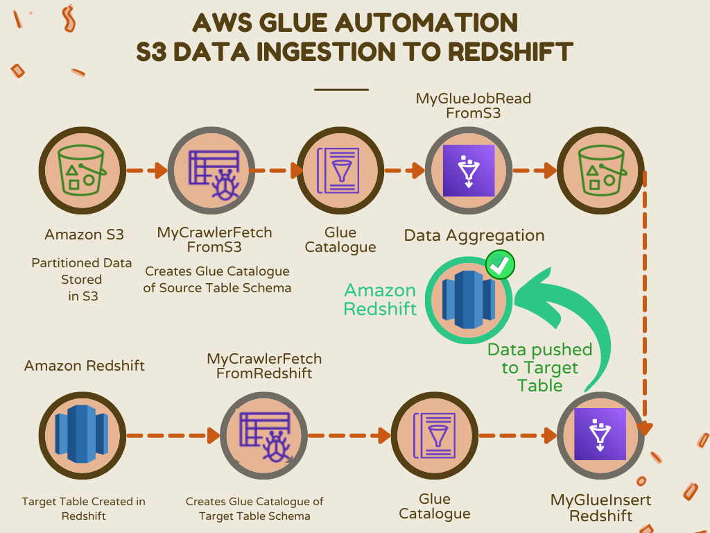

# Project: AWS Glue Automation: S3 Data Ingestion to Redshift

## Overview

This project is designed to efficiently ingest sales data from Amazon S3 into AWS Redshift using cloud-based tools and services. The entire workflow is automated using AWS Glue, ensuring seamless data transformation and loading.

## Workflow

1. **Sales Data Organization:**
   - Data is stored in different folders in an S3 bucket, organized by the year.

2. **Glue Crawler Schema Creation:**
   - Utilizing the **_Glue Crawler_** named *MyCrawlerFetchFromS3*, the data is crawled, and a schema is dynamically created based on the table structure and data types.

3. **ETL Job for Data Transformation:**
   - The ETL job, named *MyGlueJobReadFromS3.py* (link to code [here](#)), is developed using PySpark to transform the data.
   - Transformations include:
     - Mapping variables.
     - Converting string values for *new_seller_id* to long values.
     - Removing all inactive sellers.
     - Feature creation: Adding a new column named *new_Status* and marking all sellers as active.
     - Data aggregation: Aggregating data based on sales data and the year of sale.
   - Transformed data is written in Parquet format to an S3 bucket.

4. **Target Table Creation in AWS Redshift:**
   - A target table named *product_tab_def* is created in AWS Redshift. The SQL statement for table creation can be found [here](Redshift_DDL.txt).

5. **Glue Crawler for Target Table Schema:**
   - Another **_Glue Crawler_**, named *MyCrawlerFetchFromRedshift*, dynamically creates the schema for the target table.

6. **Data Ingestion into Redshift:**
   - Ingestion of data into the target table (*product_tab_def*) is achieved using the ETL job named *MyGlueInsertRedshift* (link to code [here](#)).

7. **Automated Workflow with Glue:**
   - The entire workflow is automated using the **_AWS Glue Workflow_**, streamlining the process from data extraction to loading.

## Project Artifacts

- [Flowchart Image](#) - Link to the flowchart illustrating the project workflow.
- [Workflow Picture](#) - Link to the picture showcasing the automated Glue Workflow.
- [Output Picture](#) - Link to the picture displaying the final output.

## Language Used

- [PySpark Logo](#) - Representation of PySpark, the primary language used for ETL job development.

Feel free to explore the provided links to gain deeper insights into specific components of the project!
